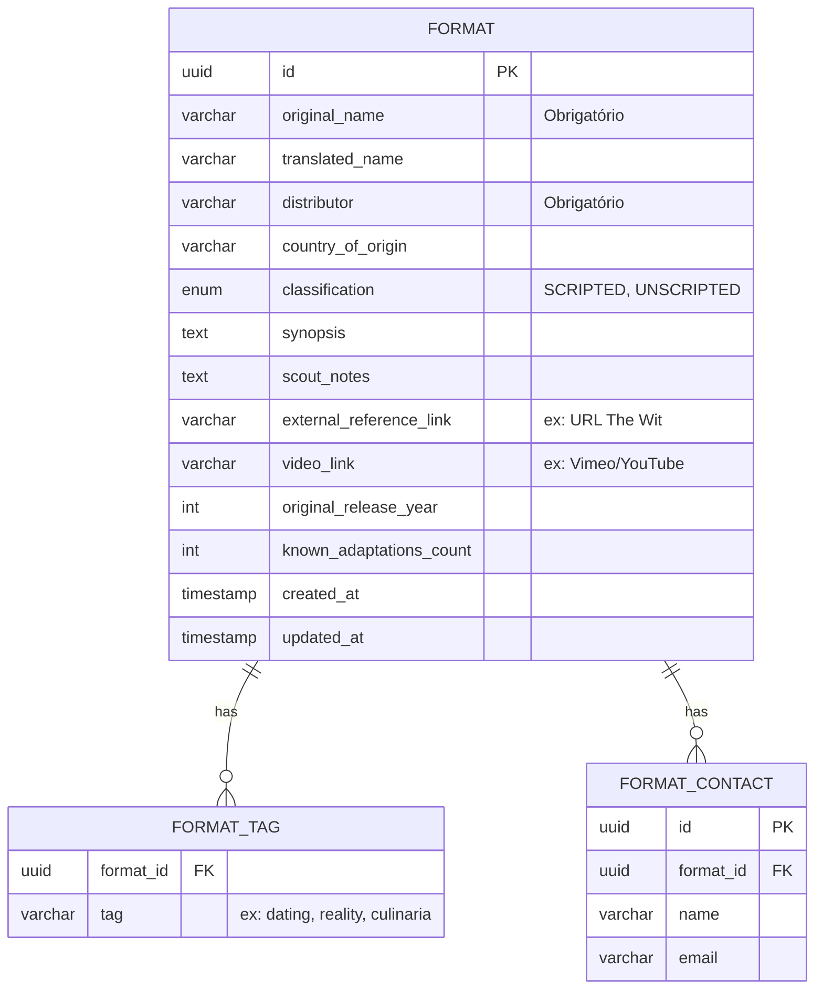

# Modelagem Relacional e Contratos de API - FEAT-001

Este documento detalha o modelo de dados e as especificações de API projetados especificamente para atender a **FEAT-001: Gestão de Acervo de Formatos & Scout de Mercado**, conforme o [PRD-gestao-formatos.md](../product/PRD-gestao-formatos.md).

## 1. Modelo de Banco de Dados (ERD)

A entidade primária do acervo é o `FORMAT`. Devido aos requisitos de tags temáticas múltiplas e contatos comerciais (1:N), adotamos tabelas associadas visando forte normalização e integridade referencial.



## 2. Contratos de Serviço (API Schemas)

### 2.1. Endpoints Base (RESTful)

| Método | Endpoint | Descrição |
|--------|----------|-----------|
| `POST` | `/api/v1/formats` | Cria um novo Formato (IP) com seus metadados, tags e contatos. |
| `GET`  | `/api/v1/formats` | Lista e busca Formatos (com suporte a paginação e filtros). |
| `GET`  | `/api/v1/formats/{id}` | Recupera os detalhes completos de um Formato específico. |
| `PUT`  | `/api/v1/formats/{id}` | Atualiza dados cadastrais, tags e dados de scout do Formato. |

### 2.2. Payload de Criação / Atualização (Request JSON)

```json
{
  "original_name": "The Golden Bachelor",
  "translated_name": "O Solteiro de Ouro",
  "distributor": "Warner Bros.",
  "country_of_origin": "USA",
  "classification": "UNSCRIPTED",
  "tags": ["dating", "reality"],
  "synopsis": "Um spin-off de The Bachelor focando em participantes da terceira idade.",
  "commercial_contacts": [
    {
      "name": "Jane Doe",
      "email": "jane.doe@wb.example.com"
    }
  ],
  "scout": {
    "notes": "Forte aderência ao público +50. Visto no Mipcom 2023.",
    "external_reference_link": "https://thewit.com/format/12345",
    "video_link": "https://vimeo.com/123456789",
    "original_release_year": 2023,
    "known_adaptations_count": 2
  }
}
```

### 2.3. Parâmetros de Busca (Query) para `GET /api/v1/formats`

Para suportar a **RF-015 (Busca e Filtros do Acervo)**, a API de listagem aceita os seguintes parâmetros *query string*:
- `q`: Termo de busca em texto livre (aplica no nome original, nome traduzido, sinopse, distribuidor).
- `distributor`: Filtro exato por distribuidor.
- `classification`: `SCRIPTED` ou `UNSCRIPTED`.
- `tags`: Filtro que inclui registros contendo as tags informadas (ex: `?tags=dating,reality`).

*Nota Arquitetural: Os filtros adicionais exigidos pelo RF-015 ("status da negociação", "vigência" e "demandante") exigirão suporte da entidade Negociações (a ser criada na FEAT-002), de modo que este endpoint base deverá ser extensível para processar *joins* condicionalmente em futuras iterações.*

### 2.4. Resposta Padrão de Listagem (Response JSON)

```json
{
  "data": [
    {
      "id": "e8d4b3c9-1a2b-4c3d-9e8f-0123456789ab",
      "original_name": "The Golden Bachelor",
      "translated_name": "O Solteiro de Ouro",
      "classification": "UNSCRIPTED",
      "distributor": "Warner Bros.",
      "tags": ["dating", "reality"],
      "created_at": "2026-10-09T10:00:00Z"
    }
  ],
  "pagination": {
    "page": 1,
    "limit": 20,
    "total_count": 145,
    "total_pages": 8
  }
}
```

## 3. Rastreabilidade
* **PRD Relacionado:** [PRD-001: Sistema de Gestão de Formatos](../product/PRD-gestao-formatos.md)
* **Feature Base:** [FEAT-001: Gestão de Acervo](../features/FEAT-001-gestao-acervo.md)
* **ADR Associado:** [ADR-001: Seleção de Banco de Dados Relacional](ADR-001-selecao-banco.md)
