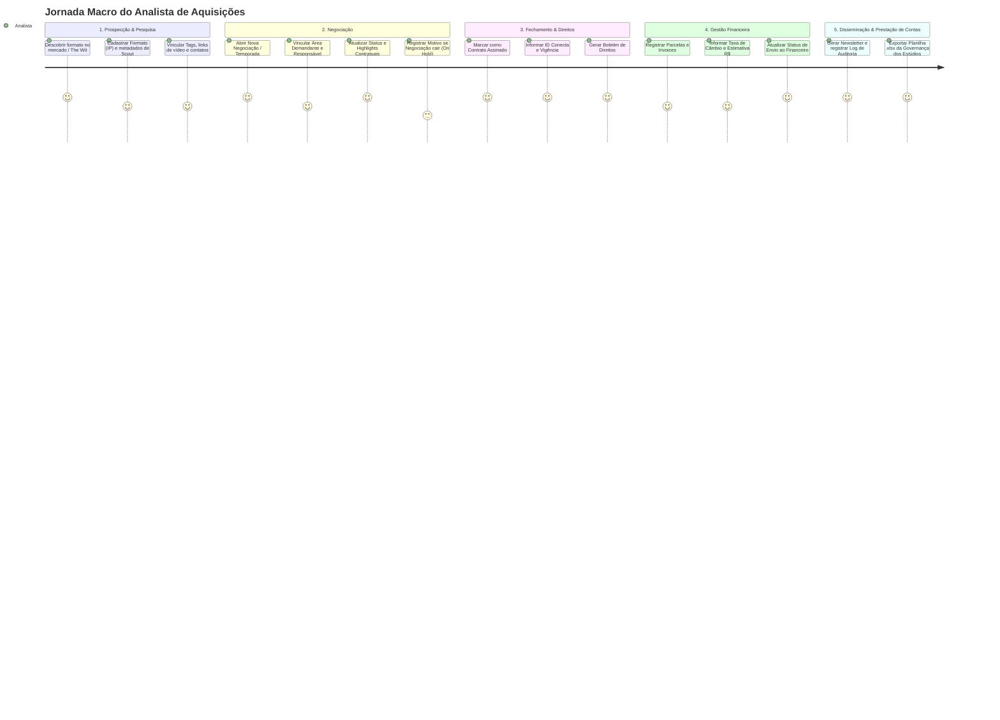

# Product Requirements Document (PRD) — Sistema de Gestão de Formatos (Atlas)

## 1. Visão Geral do Produto
O **Atlas - Gestão de Formatos** é uma plataforma corporativa web desenvolvida sob medida para a área de Aquisições de Conteúdo da Globo. O sistema foi concebido para centralizar a inteligência de mercado, o histórico de negociações, os marcos contratuais e o acompanhamento financeiro de formatos audiovisuais (ficção e não ficção / *scripted* e *unscripted*).

A solução substitui definitivamente controles manuais vulneráveis em planilhas eletrônicas e a experiência prévia com o Monday.com, estabelecendo um repositório central de dados com rastreabilidade auditável, governança relacional e geração automatizada de relatórios para stakeholders estratégicos (Governança dos Estúdios, Governança de Direitos e Comunicação).

---

## 2. Objetivos de Negócio (OKRs/KPIs)
- **OKR 1: Preservação da Memória e Inteligência da Área**
  - *Métrica:* 100% dos formatos pesquisados e contratados registrados em repositório único, eliminando a dependência do conhecimento tácito individual.
  - *Métrica:* 100% de registro dos motivos de declínio (*on hold* ou cancelamento) para alimentar aprendizados em futuras negociações.
- **OKR 2: Eficiência Operacional e Comunicação com Stakeholders**
  - *Métrica:* Geração da exportação trimestral para a Governança dos Estúdios em formato `.xlsx` formatado com 1 clique (redução de dias de consolidação manual para segundos).
  - *Métrica:* Geração de Boletins de Fechamento e Newsletters a partir de comando direto do usuário na plataforma.
- **OKR 3: Acompanhamento Rigoroso de Obrigações Financeiras**
  - *Métrica:* Visibilidade total sobre o ciclo de invoices de formatos licenciados (identificação de status: Pendente, Enviado ao Financeiro e Pago).

---

## 3. Escopo e Fora de Escopo

### In-Scope (MVP):
1. **Módulo de Formatos (IP Base):** Cadastro e manutenção de propriedades intelectuais com metadados perenes (Título original, Título traduzido, Distribuidor, País de origem, Gênero/Tags temáticas, Classificação Scripted/Non-Scripted, Sinopse e Contatos do distribuidor).
2. **Scout de Conteúdo (The Wit & Mercado):** Campos dedicados a referências, links (Vimeo, YouTube, plataforma *The Wit*), ano de lançamento e anotações qualitativas de mercado.
3. **Módulo de Negociações / Temporadas / Contratos (Entidade Filha):**
   - Gestão de múltiplos ciclos/temporadas por Formato;
   - Ponto de entrada flexível (possibilidade de iniciar diretamente em negociação sem passar por pesquisa formal);
   - Registro de dados operacionais e regulatórios: Temporada, Demandante/Produto interno, Responsável pela negociação, Vigência (início/fim), Prazo de renovação, ID Conecta, Episódios contratados (mínimo, máximo e total) e Highlights/pontos de atenção contratuais;
   - Máquina de estados da negociação: *Em Negociação*, *Em Discussão de Contrato*, *Contrato em Elaboração*, *Contrato em Assinatura*, *Contrato Assinado*, *On Hold* e *Cancelada*;
   - Campo obrigatório de justificativa/motivo para status *On Hold* e *Cancelada*.
4. **Módulo de Acompanhamento Financeiro (Invoices & Parcelas):**
   - Estruturação dos valores contratuais por categoria (License fee por episódio, Total de licença, Consultoria, Tecnologia, Outros e WHT);
   - Suporte a múltiplas moedas (USD, EUR, GBP, BRL) com inserção manual da taxa de câmbio de referência e valor estimado em R$;
   - Cadastro e acompanhamento de parcelas contratuais e invoices (Número da invoice, Data de encaminhamento ao financeiro, Status: *Pendente*, *Enviado ao Financeiro*, *Pago* e Comprovante/Obs).
5. **Comunicação, Boletins e Newsletters:**
   - Geração de Boletim Contratual de Direitos a partir de comando no sistema (para repasse à Governança de Direitos e Comunicação/Marcas);
   - Geração de Newsletter mensal de destaques de mercado a partir de comando do usuário;
   - Log e auditoria de envios (registro de títulos comunicados, data do envio, destinatários/áreas notificadas e responsável).
6. **Módulo de Exportação:**
   - Exportação em planilha Excel (`.xlsx`) padronizada para alimentação da Governança dos Estúdios e controles internos.

### Out-of-Scope (Explicitamente Fora do MVP):
- **Gestão de Eventos e Obras Literárias:** Foco exclusivo em Formatos no MVP; as demais verticais serão incorporadas em ondas posteriores.
- **Gestão de Formatos Próprios / Criação de Bíblia:** O desenvolvimento de formatos internos (ex: *Estrela da Casa*) e licenciamento para players terceiros está fora do escopo.
- **Integração com JVs (Joint Ventures):** O sistema atende exclusivamente aquisições da Globo e demandas de Globo Filmes.
- **Liquidação Bancária e ERP Financeiro:** O sistema não realiza pagamentos nem substitui o IBMS.
- **Integrações Automatizadas via API (The Wit, IBMS, Banco Central):** Não haverá scraping/API do portal *The Wit* nem consulta automática a cotações de moedas no MVP.
- **Acesso Externo de Clientes Demandantes:** Áreas solicitantes (Estúdios, Globoplay, etc.) não terão credenciais de acesso ao sistema; receberão apenas os relatórios e arquivos exportados.
- **Dashboards Gráficos Avançados e Análise Preditiva de BI:** Painéis visuais analíticos complexos ficam para fases posteriores.

---

## 4. Casos de Uso Principais (Jornada Macro do Usuário)

1. **Jornada 1 — Catalogação de Formato & Scout:** O analista identifica um formato relevante (via feira, catálogo de distribuidor ou consulta ao *The Wit*), cadastra o IP no Atlas com tags temáticas, país, distribuidor, sinopse e links de referência.
2. **Jornada 2 — Condução da Negociação:** A partir de uma demanda de produto ou oportunidade, o analista abre uma negociação vinculada ao Formato. Define a temporada, estimativa de episódios, valores de proposta e acompanha a tramitação de contratos (*Em Discussão*, *Em Elaboração*, *Em Assinatura*). Caso a negociação seja interrompida, o analista altera o status para *On Hold* ou *Cancelada* e obrigatoriamente preenche a justificativa.
3. **Jornada 3 — Fechamento e Disparo de Boletim:** Com o contrato assinado, o analista preenche o ID Conecta, as datas de vigência, regras de renovação e os pontos de atenção (*highlights* regulatórios). Em seguida, aciona o comando para geração do **Boletim de Formato**, disponibilizando o resumo estruturado para Governança de Direitos e Licenciamento de Marcas.
4. **Jornada 4 — Acompanhamento de Invoices e Câmbio:** O analista lança a grade de parcelas previstas. Ao receber a invoice do distribuidor, confere valores de licença, consultoria e tecnologia, insere a taxa de câmbio manual para cálculo da estimativa em R$ e atualiza o status de acompanhamento (*Enviado ao Financeiro* / *Pago*).
5. **Jornada 5 — Exportação Governança dos Estúdios:** A cada trimestre, o analista acessa a funcionalidade de exportação e emite a planilha padronizada em formato `.xlsx` com o recorte consolidado de formatos vigentes e em negociação para compartilhamento institucional.

---

## 5. Lista de Requisitos

### Requisitos Funcionais (RF)
- **RF-001 (Cadastro de Formato / IP):** O sistema deve permitir o cadastro e edição de propriedades intelectuais (Formatos), registrando: Nome original, Nome traduzido, Distribuidor, País de origem, Classificação (*Scripted* / *Unscripted*), Tags temáticas (ex: *dating, quiz, culinária, reality, talento*), Sinopse, Contatos comerciais do distribuidor (nome e e-mail).
- **RF-002 (Dados de Scout e Mercado):** O sistema deve disponibilizar campos para anotações de pesquisa de mercado, link de referência externa (ex: *The Wit*), link de vídeo (Vimeo/YouTube), ano de lançamento original e quantidade de adaptações conhecidas.
- **RF-003 (Gestão de Temporadas / Negociações):** O sistema deve permitir a criação de múltiplos registros de negociação/temporada vinculados a um Formato-mãe.
- **RF-004 (Entrada Direta em Negociação):** O sistema deve permitir criar uma negociação diretamente, sem exigir que o formato tenha passado previamente pelo fluxo de pesquisa.
- **RF-005 (Campos Operacionais da Negociação):** Cada registro de negociação deve conter: Temporada, Programa/Produto demandante da Globo, Área demandante (ex: Estúdios, Globoplay, Canais), Analista responsável pela negociação, Data de solicitação, Data de início da negociação, Nº de episódios (mínimo, máximo e contratado), Duração média por episódio.
- **RF-006 (Controle de Status da Negociação):** O sistema deve suportar os estados: *Em Negociação*, *Em Discussão de Contrato*, *Contrato em Elaboração*, *Contrato em Assinatura*, *Contrato Assinado*, *On Hold* e *Cancelada*.
- **RF-007 (Justificativa Obrigatória de Encerramento):** Ao alterar o status da negociação para *On Hold* ou *Cancelada*, o sistema deve exigir o preenchimento obrigatório de um campo descritivo com o motivo do encerramento/rejeição.
- **RF-008 (Highlights Contratuais e Vigência):** Para contratos fechados/assinados, o sistema deve registrar: Resumo dos termos principais, Data de assinatura, Início e fim da vigência, Prazo de renovação, ID Conecta e Highlights contratuais (pontos de atenção para mitigação de riscos na produção).
- **RF-009 (Estrutura Financeira Multimoeda):** O sistema deve permitir registrar os valores contratados em moeda estrangeira (USD, EUR, GBP ou BRL), discriminando: License Fee total, License Fee por episódio, Consultoria, Tecnologia, Direitos Internacionais e Outros Valores (com campo de especificação).
- **RF-010 (Câmbio Manual e Estimativa em R$):** O sistema deve permitir que o usuário informe a cotação cambial de referência e calcule/registre a estimativa do montante em Reais (BRL).
- **RF-011 (Gestão de Invoices e Parcelas):** O sistema deve permitir o desdobramento do contrato em parcelas, registrando para cada uma: Número da invoice, Valor na moeda original, Valor estimado em R$, WHT (se retido pela Globo ou pelo distribuidor), Data de encaminhamento ao financeiro, Observações e Status (*Pendente*, *Enviado ao Financeiro*, *Pago*).
- **RF-012 (Geração de Boletim de Direitos):** O sistema deve disponibilizar funcionalidade acionada por comando do usuário para gerar o documento/resumo estruturado do Boletim de Direitos a partir dos dados do contrato assinado.
- **RF-013 (Geração e Auditoria de Newsletters):** O sistema deve permitir ao usuário gerar uma edição de Newsletter mensal a partir dos formatos em pesquisa/mercado selecionados e registrar no histórico: Títulos enviados, Data de envio, Áreas demandantes notificadas e Usuário responsável.
- **RF-014 (Exportação Governança dos Estúdios em Excel):** O sistema deve fornecer recurso de exportação que gere um arquivo `.xlsx` (Excel) com layout e colunas formatadas para alimentação do painel da Governança dos Estúdios (contendo formatos vigentes e em negociação).
- **RF-015 (Busca e Filtros do Acervo):** O sistema deve permitir filtrar e buscar formatos por nome, distribuidor, gênero/tags, status da negociação, vigência (vigente/vencido) e demandante.

### Requisitos Não Funcionais (RNF)
- **RNF-001 (Usabilidade e Produtividade):** Interface web intuitiva e responsiva, minimizando a quantidade de cliques para preenchimento de formulários e acompanhamento de status.
- **RNF-002 (Integridade Relacional):** O modelo de dados deve assegurar a integridade relacional estrita (1:N) entre o Formato (IP) e suas Negociações/Temporadas, e entre a Negociação e suas Parcelas financeiras.
- **RNF-003 (Desempenho de Consulta e Exportação):** A exportação de relatórios em `.xlsx` com o volume integral da base deve ser gerada em tempo inferior a 5 segundos.
- **RNF-004 (Controle de Acesso e Perfil):** Acesso autenticado com perfil operacional compartilhado de visibilidade total entre todos os membros da equipe de Aquisições.
- **RNF-005 (Exportação Compatível):** Arquivos gerados em Excel devem ser plenamente compatíveis com as versões mais recentes do Microsoft Office 365 e ferramentas corporativas da Globo.
- **RNF-006 (Extensibilidade Arquitetural):** O esquema de banco de dados deve ser arquitetado de forma modular, permitindo a adição futura das entidades *Eventos* e *Obras Literárias* sem refatoração destrutiva do núcleo de Formatos.

---

## 6. Regras de Negócio Críticas (RN)
- **RN-001 (Desacoplamento IP vs. Temporada):** Metadados fundamentais do Formato (Nome, Sinopse, Distribuidor, Gênero) não podem ser sobrescritos ao cadastrar novas temporadas. Cada negociação ou temporada representa uma entidade filha com vigência e valores independentes.
- **RN-002 (Trava de Justificativa de Descarte):** Nenhuma negociação pode ser transicionada para o status *On Hold* ou *Cancelada* sem o preenchimento obrigatório do campo "Motivo do Declínio/Pausa".
- **RN-003 (Independência de Liquidação Bancária):** O status *Pago* de uma parcela no Atlas representa uma conferência e confirmação de encaminhamento operacional pelo time de Aquisições, não tendo papel de quitação bancária oficial (atribuição do IBMS).
- **RN-004 (Transparência Cambial):** Todo relatório ou exibição que apresente valores convertidos em Reais (BRL) deve indicar de forma destacada a data/taxa de câmbio utilizada, mantendo sempre o valor na moeda contratada como verdade factual primária.
- **RN-005 (Imutabilidade do Log de Auditoria):** Uma vez registrado o envio de um título em uma Newsletter/comunicação para clientes internos, o registro não pode ser excluído nem alterado, resguardando o histórico para fins de auditoria interna.

---

## 7. Dependências e Integrações
- **Sistemas Internos de Referência:**
  - **ID Conecta:** Campo de texto estruturado para associação com o sistema corporativo de contratos da Globo (sem dependência de API no MVP).
  - **IBMS:** Referência informativa do processo financeiro (sem integração técnica direta no MVP).
- **Formatos de Saída de Dados:**
  - Biblioteca de geração de planilhas Excel (`.xlsx`) no servidor/backend.
- **Fontes Externas:**
  - Links externos para Vimeo, YouTube e plataforma *The Wit* (gerenciados via URL).

---

## 8. Plano de Go-to-Market / Lançamento
1. **Fase 1 — Homologação da Estrutura de Dados e Protótipos:** Validação com a equipe de Aquisições dos fluxos de tela e da modelagem de dados.
2. **Fase 2 — Carga e Higienização dos Dados Legados:** Migração dos dados históricos contidos em `Acompanhamento de formatos.xlsx` e `Formatos_dados.xlsx` para a nova base de dados.
3. **Fase 3 — Rollout Piloto com a Equipe de Aquisições:** Utilização assistida do sistema pela equipe no dia a dia para cadastro das negociações vigentes e acompanhamento de parcelas ativas.
4. **Fase 4 — Virada de Chave (Desativação das Planilhas):** Descontinuação do uso das planilhas de Formatos e primeira emissão oficial da planilha trimestral para a Governança dos Estúdios diretamente pelo Atlas.

---

## 9. Perguntas em Aberto e Decisões

### Decisões Registradas (Rodada 1 de Elicitação):
- **DEC-001 (Foco Exclusivo no MVP):** O MVP focará exclusivamente na vertical de Formatos. Eventos e Obras Literárias entram nas fases 2 e 3.
- **DEC-002 (Scout Manual):** A referência ao portal *The Wit* será feita por campos de anotação e link manual, sem scrapers ou APIs no MVP.
- **DEC-003 (Exclusão de Formatos Próprios):** A gestão de Bíblia e formatos próprios da casa está formalmente fora do escopo do Atlas.
- **DEC-004 (Arquitetura Formato x Temporada):** Adotada a estrutura relacional de 1 Formato (IP) para N Temporadas/Negociações.
- **DEC-005 (Entrada Direta em Negociação):** Permitido iniciar registros diretamente na fase de negociação sem passagem prévia obrigatória pela fase de pesquisa.
- **DEC-006 (Justificativa de Status):** Obrigatório registrar o motivo de rejeição/pausa sempre que um formato for marcado como *On Hold* ou *Cancelada*.
- **DEC-007 (Público Demandante Sem Acesso Direto):** Clientes internos não possuem login no sistema no MVP, consumindo relatórios e boletins exportados.
- **DEC-008 (Visibilidade Interna Ampla):** Todos os integrantes da equipe de Aquisições têm visibilidade total dos valores contratuais e financeiros.
- **DEC-009 (Acompanhamento Operacional de Pagamentos):** O módulo financeiro realiza o controle de parcelas, datas de envio e status (*Pendente*, *Enviado*, *Pago*), sem conexão de liquidação bancária.
- **DEC-010 (Câmbio Manual):** As taxas de conversão de moeda estrangeira para BRL serão inputadas manualmente pelos usuários.
- **DEC-011 (Boletins e Newsletters sob Comando):** O sistema gerará as comunicações mediante ação explícita do usuário, registrando log de auditoria.
- **DEC-012 (Exportação Excel para Governança):** O formato de exportação prioritário para a Governança dos Estúdios é a planilha Excel (`.xlsx`) formatada.
- **DEC-013 (Métricas Analíticas em Fase Posterior):** Dashboards complexos e métricas agregadas automáticas não farão parte do escopo inicial de entrega.

---

## 10. Avaliação de Impacto (Triage)
- [x] **Impacta Interface de Usuário?** *(Se sim, requer template `UX-JOURNEY.md` antes das Histórias)*
  - **Justificativa:** O sistema requer interface web rica e responsiva para que os analistas realizem cadastros de IP, gerenciem o pipeline de negociações de temporadas, preencham dados de invoices e acionem a emissão de boletins, newsletters e exportações.
- [x] **Criação/Alteração de Componentes Estruturais, Banco de Dados ou APIs?** *(Se sim, requer template `ADR.md` ou `SOLUTION-ARCHITECTURE.md` antes das Histórias)*
  - **Justificativa:** A demanda exige a criação da arquitetura do novo sistema, modelagem do banco de dados relacional (Formatos 1:N Temporadas 1:N Parcelas), endpoints de API backend e mecanismo de exportação de planilhas `.xlsx`.

---

## 11. Rastreabilidade
- **Discovery Document:** [`DISCOVERY.md`](file:///c:/Dev/Projetos/Globo/Atlas/docs/product/DISCOVERY.md)
- **Insumos de Negócio:** [`descritivo-inicial.md`](file:///c:/Dev/Projetos/Globo/Atlas/docs/product/inputs/descritivo-inicial.md) e [`pontos-reuniao-190.md`](file:///c:/Dev/Projetos/Globo/Atlas/docs/product/inputs/pontos-reuniao-190.md)
- **Planilhas Base:** `Formatos_dados.xlsx` e `Acompanhamento de formatos.xlsx`
- **Features (Épicos):**
  - [`FEAT-001: Gestão de Acervo`](file:///c:/Dev/Projetos/Globo/Atlas/docs/features/FEAT-001-gestao-acervo.md)
  - [`FEAT-002: Pipeline de Negociações`](file:///c:/Dev/Projetos/Globo/Atlas/docs/features/FEAT-002-pipeline-negociacoes.md)
  - [`FEAT-003: Gestão Financeira`](file:///c:/Dev/Projetos/Globo/Atlas/docs/features/FEAT-003-gestao-financeira.md)
  - [`FEAT-004: Disseminação e Comunicação`](file:///c:/Dev/Projetos/Globo/Atlas/docs/features/FEAT-004-disseminacao-comunicacao.md)
  - [`FEAT-005: Exportação Estúdios`](file:///c:/Dev/Projetos/Globo/Atlas/docs/features/FEAT-005-exportacao-estudios.md)
